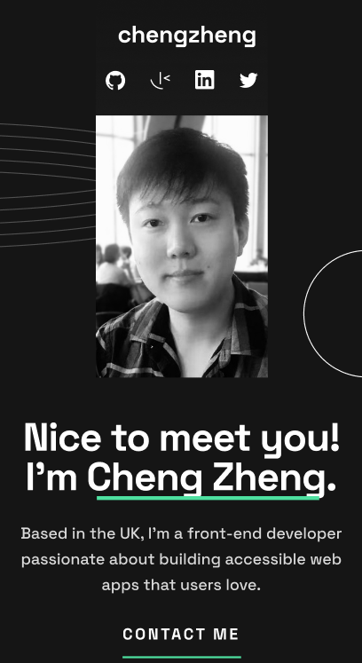
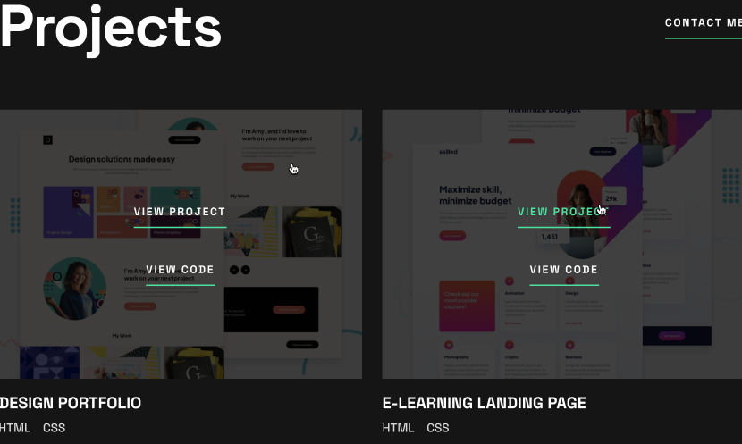

## Developer-portfolio - still in progress !

  | Live Site URL: | [https://jackzz119.github.io/My_developer-portfolio-//](https://jackzz119.github.io/My_developer-portfolio-/) |
  ||| 

Technique used:
1. Semantics HTML
2. Css
3. Responsive, Media query
4. Javascript
5. Accessiblilty
6. Figma
7. Photoshop

## *Preview*

## **Let's Connect 👋**

  &nbsp;&nbsp;&nbsp;

  <!--  &nbsp;&nbsp;&nbsp; -->

  

 